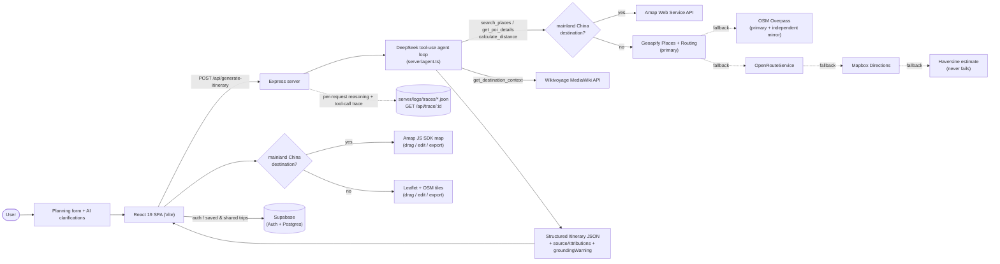

# Wayfound

> Find your way, anywhere.

**Live demo:** https://wayfound-ezv.pages.dev

Wayfound is an AI trip-planning tool: describe a trip (destination, dates, group, vibe, budget, special needs), and a tool-using LLM agent generates a structured, day-by-day itinerary — grounded in real place data wherever that data is available, and transparent about it when it isn't. You then edit the result on a map + list dual-pane view (drag places between days, swap them out, reorder a day's route).

## Problem statement

Generic "ask an LLM to plan my trip" tools have two recurring failure modes: the model **hallucinates plausible-sounding places** that don't exist or aren't where it says they are, and — when a project does bolt on a real places API — a **single provider going down or being priced wrong silently degrades the whole product** with no visibility into why. Wayfound is a small, concrete testbed for both problems: a tool-use agent whose place data is grounded and *scored* (an eval harness measures how often generated places trace back to a real search hit), and a map/routing layer engineered for graceful multi-provider degradation instead of a hard dependency on one API.

## Architecture



Every arrow into the dashed boxes on the map/routing side is a fallback, not a hard requirement — see [Reliability engineering](#reliability-engineering-the-map-provider-story) below for why that shape exists and what it fixed.

## Tech stack

| Layer | Choice |
|---|---|
| Frontend | React 19 + TypeScript, Vite 6, Tailwind CSS v4, `@dnd-kit` (drag & drop), `motion` |
| Backend | Express (`tsx` in dev, `esbuild` CJS bundle in prod) |
| Agent / LLM | DeepSeek (`deepseek-chat`) via the OpenAI SDK, manual ReAct-style tool-calling loop |
| Map rendering | Amap JS SDK (China) / Leaflet + OpenStreetMap raster tiles (international) — routed by the same destination heuristic the backend uses (`server/tools/provider.ts`'s `getMapProvider`, shared client-side) |
| Place data (China) | Amap (高德) Web Service API |
| Place data (international) | Geoapify Places + Routing (primary) → OpenStreetMap Overpass, two independent instances (fallback) |
| Routing (international) | Geoapify Routing → OpenRouteService → Mapbox Directions → haversine estimate (4-layer fallback, never throws) |
| Destination context | Wikivoyage MediaWiki API (CC BY-SA 4.0), grounds `aiNote` / "why visit" copy |
| Auth / persistence | Supabase (Auth + Postgres) |
| Testing | Vitest (unit/component), a separate LLM-judge fuzzy suite, Playwright (E2E), a standalone agent eval harness (below) |
| Deploy | Frontend on Cloudflare Pages, backend on Render |

## Reliability engineering: the map-provider story

This is the part of the project actually worth reading if you're evaluating the engineering, not just the product.

International destinations initially depended on Mapbox's Search Box API, which turned out to be session-billed (built for interactive autocomplete, not one-shot agent tool calls) and was racking up unexpected charges. The fix — swap in the free OpenStreetMap Overpass API — worked, until live eval runs started showing it fail *completely*: two separate real test runs (Tokyo, then Paris) came back with a **100% hallucination rate** for international destinations. A direct connectivity probe (bypassing the app entirely) confirmed it wasn't a bug on this end — Overpass's primary public instance was refusing connections outright, and an independent mirror wasn't responding either, while a control request to Nominatim answered normally in the same second.

That evidence is what justified adding Geoapify (a commercially-hosted, free-tier place/routing API) as the **primary** provider, with the whole free chain — Overpass, its mirror, OpenRouteService, Mapbox, a haversine estimate — kept as zero-cost fallback layers rather than deleted. Every layer in `server/tools/mapbox.ts` and `server/tools/geoapify.ts` is built to degrade soft (log and fall through) instead of throwing, so one provider's bad day degrades quality, not the whole request.

**Before/after, same eval cases, re-run once Geoapify landed:**

| Case | Hallucination rate before | Hallucination rate after |
|---|---:|---:|
| Tokyo, 6-day family trip | 100% | 15% |
| Paris, 5-day couple trip | 100% | 0% |
| Beijing, domestic (Amap — unaffected either way) | 0% | 0% |

*Hallucination rate = the share of places in the final itinerary that can't be traced back to a real `search_places` hit in that run's tool-call trace — see `tests/eval/scoring.ts`.* Domestic (mainland China, via Amap) has stayed consistently in the 0–8% range across dozens of live eval runs throughout development; it was never affected by any of this, since it's routed to a different provider entirely (see the architecture diagram).

The same investigation-and-fix pattern was applied to the Wikivoyage grounding feature: an eval scoring dimension (`scoreDestinationContextUsage`) initially reported a false "40% attribution-consistent" reading, traced to the eval harness computing UI attribution credits differently than the real API route did — fixed by extracting one shared `computeSourceAttributions` function both now call, confirmed back to 100% on the next live run.

## Key features

- **Form → AI clarifications → structured itinerary.** Rule-based clarification questions (no wasted LLM call) feed into a DeepSeek tool-use loop that calls real search/routing/context tools and emits a day → time-slot → place tree.
- **Map + list dual-pane editing.** Drag a place between slots/days, delete with undo, re-search and swap a place, all synced to the map.
- **Grounded destination copy.** `get_destination_context` pulls a real Wikivoyage extract so `aiNote`/summary text isn't purely the model's imagination — with CC BY-SA 4.0 attribution shown in the UI.
- **Returning-user memory.** A localStorage-backed profile (preferred vibes, budget lean, past destinations, disliked place types) is folded into the next generation's prompt as a soft preference, never overriding the current form.
- **Request tracing.** Every generation gets a `requestId`, a full reasoning/tool-call trace persisted server-side, and a debug-gated in-app viewer (`?debug=1`) to inspect exactly what the agent did and why.
- **Honesty by default.** When a run's place searches mostly failed, the UI shows a small disclaimer that some details came from general knowledge rather than pretending everything was verified.

## Run locally

```bash
npm install
npm run dev
```

## Environment

Copy `.env.example` to `.env` and fill in:

| Variable | Required | Purpose |
|---|---|---|
| `DEEPSEEK_API_KEY` | yes | Agent LLM |
| `AMAP_API_KEY`, `AMAPJS_API_KEY`, `AMAP_SECURITY_CODE` | yes | Amap Web Service + JS SDK (China place search, map rendering) |
| `SUPABASE_URL`, `SUPABASE_ANON_KEY` | yes | Auth + saved/shared itineraries |
| `GEOAPIFY_PLACES_API_KEY`, `GEOAPIFY_ROUTING_API_KEY` | recommended | Primary international place search + routing (free tier, no card) |
| `ORS_API_KEY` | optional | Routing fallback if Geoapify is unset/fails |
| `MAPBOX_ACCESS_TOKEN` | optional | Geocoding for search radius anchoring + last-resort routing fallback; everything degrades gracefully without it |

Supabase table/OAuth setup: [`docs/SUPABASE_SETUP.md`](./docs/SUPABASE_SETUP.md).

## Testing

```bash
npm run test           # unit/component (Vitest, mocked — safe, no external calls)
npm run test:watch
npm run test:e2e       # Playwright
```

**Agent eval harness** (tool-call correctness, constraint satisfaction, hallucination rate, Wikivoyage grounding consistency, optional LLM-as-judge quality) — calls the live agent and real external APIs, so it costs real tokens/requests:

```bash
npm run eval                                          # all cases in tests/eval/cases.json
EVAL_FILTER=tokyo-family-food-culture npm run eval     # one case
EVAL_SKIP_JUDGE=1 npm run eval                         # skip the judge call
```

Reports land in `tests/eval/reports/latest.{json,md}`, with each case's full generated itinerary saved alongside under `tests/eval/reports/itineraries/` for manual review.

## Known limitations

- International place/route data is best-effort across a 4–5 layer fallback chain, not a guaranteed single source of truth — see the reliability section above.
- `get_weather`, `validate_itinerary` (auto-correction loop), `search_flights`, `search_hotels` are specced but not implemented; `/api/verify-itinerary` exists as a standalone critic endpoint, not wired into the generation loop itself.
- Memory (returning-user preferences) is per-browser `localStorage`, not synced to a Supabase account across devices.
- Trace files (`server/logs/traces/`) have no retention/cleanup policy yet — fine for a demo, not for long-running production use as-is.
